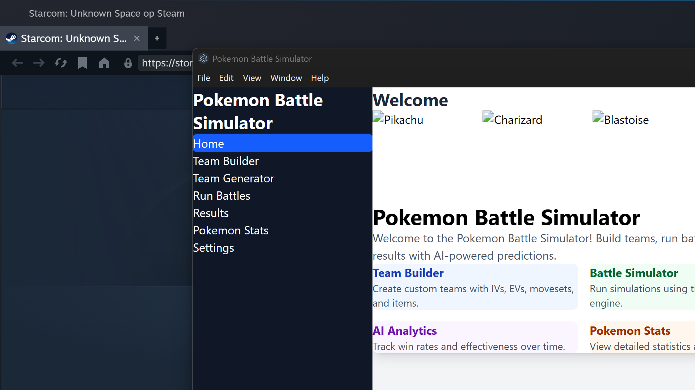

# Pokemon Battle Simulator



A desktop Pokemon battle simulator with AI-powered move predictions, team building, and battle analytics. Built with Electron, React, and TypeScript.

## Screenshots

### Home Page


### Team Builder


### Battle Simulator


### Results Dashboard


### Pokemon Analytics


## Features

- **Team Builder** - Create and manage Pokemon teams with custom IVs, EVs, and movesets
- **Battle Simulator** - Run Pokemon battles using the @pkmn/sim engine
- **AI Learning System** - Tracks move effectiveness and generates battle predictions that improve over time
- **Pokemon Analytics** - View win rates, stats, and performance data
- **Battle Logs** - Detailed turn-by-turn battle replay viewer
- **Sprite Support** - Animated and static sprites served via custom `poke://` protocol with GitHub CDN fallback

## Tech Stack

- **Electron** (v39+) - Desktop app framework with Electron Forge
- **React** + **TypeScript** - Frontend UI
- **Tailwind CSS** - Styling
- **SQLite** (better-sqlite3) - Local database
- **@pkmn/sim** + **@pkmn/dex** - Pokemon battle simulation
- **@smogon/calc** - Damage calculations
- **Recharts** - Charts and graphs
- **Zustand** - State management

## Getting Started

### Prerequisites

- [Node.js](https://nodejs.org/) (v18 or higher)
- npm

### Installation

```bash
git clone https://github.com/turkushan490/pokemon-calculator.git
cd pokemon-calculator
npm install
```

### Download Sprites

```bash
npm run download-sprites
```

This downloads animated GIF sprites (Gen 1-5) and static PNG sprites (all Pokemon).

### Run the App

```bash
npm start
```

## Scripts

| Command | Description |
|---------|-------------|
| `npm start` | Launch the app in development mode |
| `npm run package` | Create a distributable package |
| `npm run make` | Create an installer (.exe, .dmg, etc.) |
| `npm run download-sprites` | Download Pokemon sprite images |

## Project Structure

```
src/
├── main/                  # Electron main process
│   ├── data/              # PokeAPI client & data sync
│   ├── database/          # SQLite schema & repositories
│   ├── simulation/        # Battle simulation engine
│   └── ipc/               # IPC message handlers
│
└── renderer/              # React frontend
    ├── components/        # UI components
    ├── services/          # API/IPC communication layer
    └── utils/             # Sprite helpers, Pokemon utilities
```

See [PROJECT_STRUCTURE.md](PROJECT_STRUCTURE.md) for a detailed breakdown.

## Documentation

- [PROJECT_STRUCTURE.md](PROJECT_STRUCTURE.md) - Full project structure guide
- [AI_SYSTEM_README.md](AI_SYSTEM_README.md) - AI learning system details
- [SPRITE_GUIDE.md](SPRITE_GUIDE.md) - Sprite formats and usage guide

## Sprite System

Sprites are served via a custom `poke://` Electron protocol that loads images from the local `public/sprites/` folder. This avoids interfering with Electron's internal http handling.

- **Animated**: `poke://sprites/animated/{dex_number}.gif` (Gen 1-5)
- **Static**: `poke://sprites/static/{dex_number}.png` (all Pokemon)
- **Fallback**: GitHub CDN (`raw.githubusercontent.com`) if local files are missing

## License

ISC
